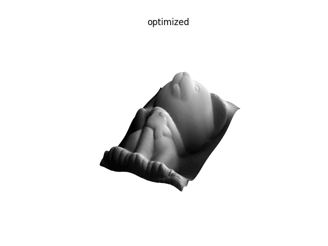

# Photometric Stereo
Estimating albedo, surface normal, depth from multiple illuminated images.

# About
This repo implements some photometric stereo algorithms. The algorithms can be found the following papers:
- Shape and Albedo from MUltiple Images using Integrability (Yuille and Snow)
- Resolving the Generalized Bas-Relief Ambiguity by Entropy Minimization (Alldrin et al.)

# Results
## Albedo, normals, and depth estimation

## Resolving GBR ambiguity

# Todo
- Coarse to fine refinement
- Paper: Reflections on the Generalized Bas-Relief Ambiguity