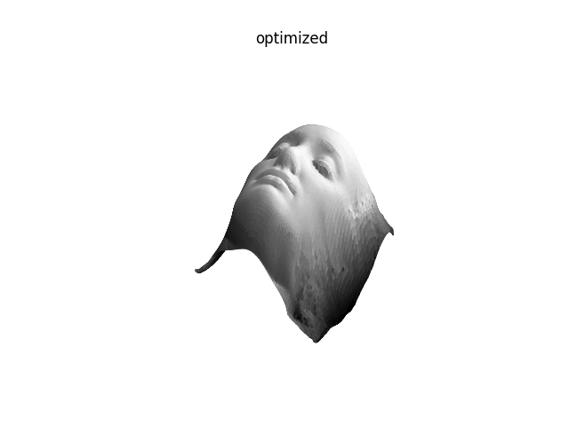

# Photometric Stereo
Estimating albedo, surface normal, depth from multiple illuminated images.

# About
This repo implements some photometric stereo algorithms. The algorithms can be found the following papers:
- Shape and Albedo from MUltiple Images using Integrability (Yuille and Snow)
- Resolving the Generalized Bas-Relief Ambiguity by Entropy Minimization (Alldrin et al.)
- A Closed-Form Solution to Uncalibrated Photometric Stereo via Diffuse Maxima (Favaro et al.)
- Self-calibrating Photometric Stereo (Shi et al.)

# Dataset
[Harvard Photometric Stereo Dataset](http://vision.seas.harvard.edu/qsfs/Data.html)

# Results
## Albedo, normals, and depth estimation

## Resolving GBR ambiguity
|cat|women|frog|
|--|--|--|
||||

## CPU and GPU versions
Both Numpy and Pytorch implementations are provided. The code is tested on a `Intel(R) Xeon(R) CPU E5-2630 v4 @ 2.20GHz` CPU and a `GeForce GTX 1080 Ti` GPU.

|Dataset|Numpy|Pytorch|
|--|--|--|
|cat|93.46s|10.61s|
|women|71.58s|9.54s|
|frog|103.13s|10.94s|

# Todo
- Coarse to fine refinement
- Paper: Reflections on the Generalized Bas-Relief Ambiguity